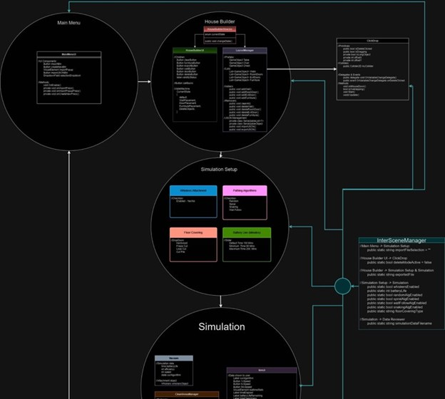
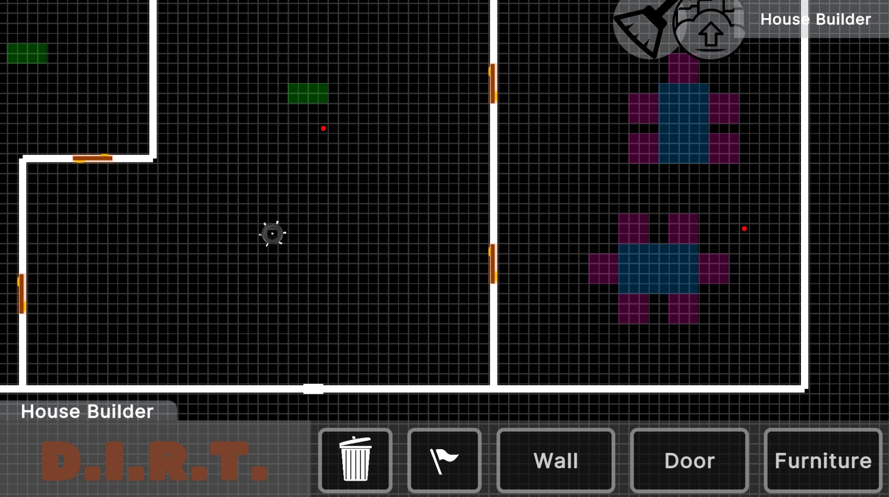
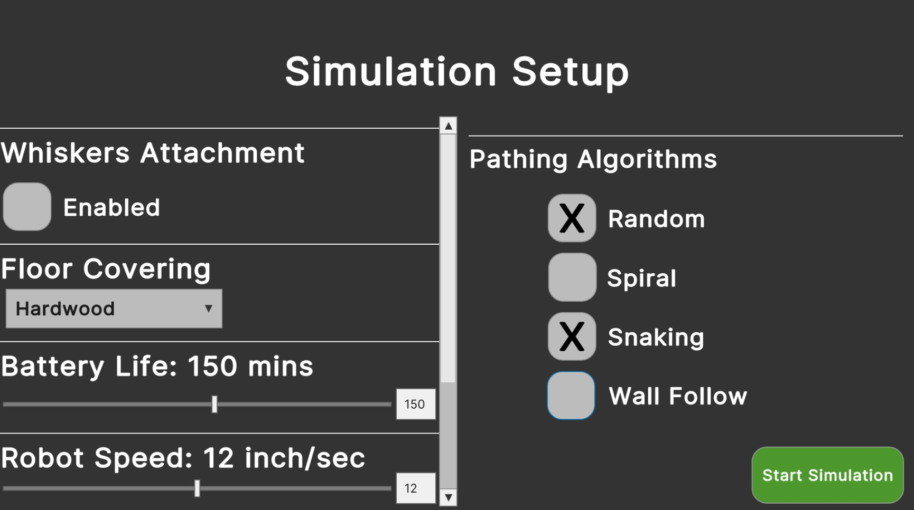
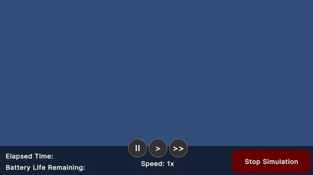

# Robot Vacuum Simulation Project

A comprehensive simulation tool to understand and enhance the effectiveness of robot vacuum algorithms by simulating real-time operations in customizable environments.

## Overview

As robot vacuums gain popularity and become more affordable, there is an increasing demand to evaluate and refine their cleaning algorithms. This simulation tool aims to provide a platform where users can design a house environment, configure the vacuum's attributes, and then simulate the vacuum's performance in real-time. Through observation and analytical results, improvements can be proposed and implemented in both the software and hardware of the robot vacuum.

## Table of Contents

- [Features](#features)
    - [House Object](#house-object)
    - [Vacuum Object](#vacuum-object)
    - [Simulation Setup and Run](#simulation-setup-and-run)
- [Constraints](#constraints)
- [Getting Started](#getting-started)

## Features

### House Object

- **Default House**: Contains rooms, doors, and obstructions.
- **Customization**: Users can modify the house, rooms, doors, and obstructions through a GUI.
- **Size Constraints**:
    - House: Minimum of 200 ft² and a maximum of 8,000 ft².
    - Room: Minimum of 4 ft² (like a closet) to the maximum of the house's current size. Every room must have at least one door.
- **Floor Covering**: Can be selected and visualized. Types include Hard, Loop Pile, Cut Pile, and Frieze-cut pile.
- **Obstructions**: Users can place chairs/tables (which vacuums can navigate under) and chests (impassable for vacuums).

### Vacuum Object

- **Default Attributes**:
    - Size: 12.8 inches in diameter
    - Vacuum Width: 5.8 inches
    - Whiskers Width: 13.5 inches (30% effective by default)
    - Speed: 3 inches/second
    - Battery Life: 150 minutes
    - Path: Random (with options for Snaking and Wall follow)
- **Customizations**: Users can adjust vacuum efficiency, whisker efficiency, speed, and pathing algorithms based on the house's floor covering.

### Simulation Setup and Run

- **Floor Plan Setup**: Users can recall saved floor plans, create new ones, or edit existing plans.
- **Robot Setup**: Customize battery life, vacuum efficiency, speed, and pathing algorithm.
- **Running Simulations**: Choose from real-time speed options (x1, x5, x50). Observations can be made on the robot's cleaning coverage with different pathing algorithms.
- **Results & Analysis**: Simulation results are color-coded to depict cleaning coverage and are automatically saved. Users can pull up and compare results from multiple runs.

## Constraints

- The Programming language used for this project is C#.
- The application is executable on a Windows PC.

## Getting Started

1. Download and install the simulation tool from https://unity.com/download.
2. Launch the application and familiarize yourself with the GUI.
3. Begin by setting up a floor plan and configuring the robot's attributes.
4. Run the simulation and observe the robot's behavior.
5. Analyze the results and make necessary adjustments for improved performance.
6. Compare results from different runs to identify the best configuration.

## Screenshots
 Archit Design
  

HouseBuilder
 

SimulationSetup
 

SimulationRunner
 

