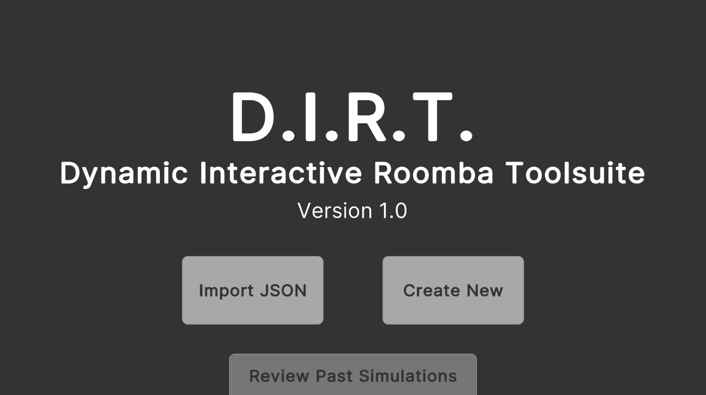
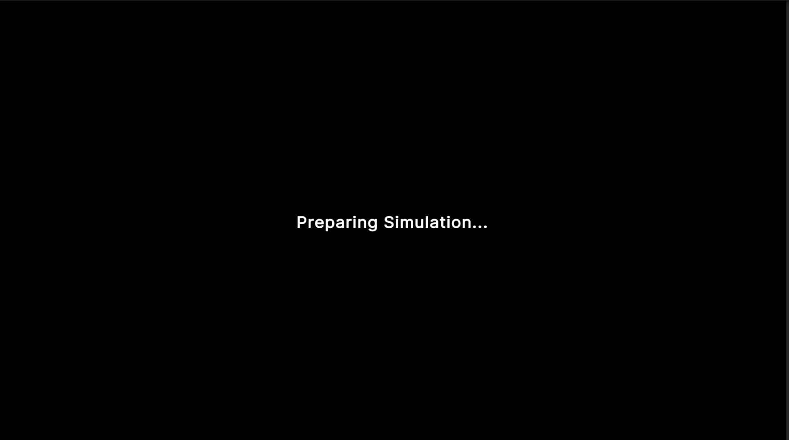
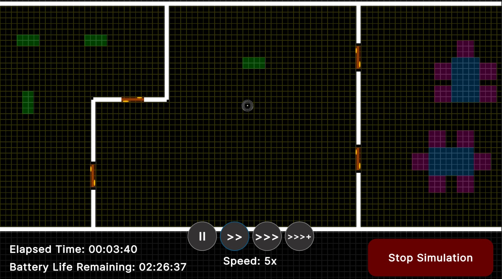
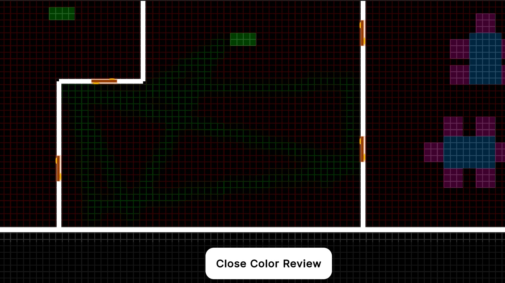
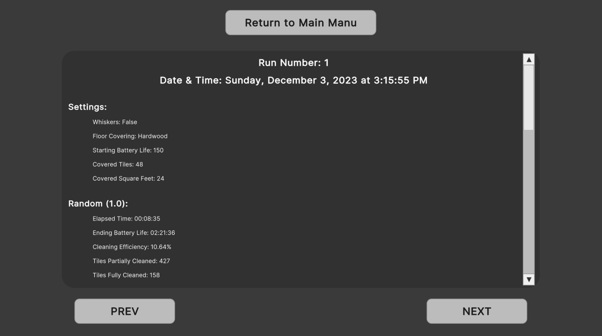

# Robot Vacuum Simulation Project
### Team Members:
- George Coppel
- Christian Vanzant
- Ian Bohanan
- Khushal Noori
------------------

A comprehensive simulation tool to understand and enhance the effectiveness of robot vacuum algorithms by simulating real-time operations in customizable environments.

## Overview

As robot vacuums gain popularity and become more affordable, there is an increasing demand to evaluate and refine their cleaning algorithms. This simulation tool aims to provide a platform where users can design a house environment, configure the vacuum's attributes, and then simulate the vacuum's performance in real-time. Through observation and analytical results, improvements can be proposed and implemented in both the software and hardware of the robot vacuum.

## Table of Contents
- [Building](#building)
- [Features](#features)
    - [House Object](#house-object)
    - [Vacuum Object](#vacuum-object)
    - [Simulation Setup and Run](#simulation-setup-and-run)
- [Constraints](#constraints)
- [Getting Started](#getting-started)

## Building
1. Download the Unity Hub application and the source code in this repository.
2. Open Unity Hub and navigate to the folder containing the source code.
    - If you have not already installed the required version of the Unity Editor, then Unity Hub should request permission to install it.
        - If Unity Hub does not install the correct version, you can manually install it in the app. The Unity Editor used is 2023.1.9f1.
3. Through Unity Hub open the project in the Unity Editor.
4. Once the editor is open, add in all of the scenes to the build settings.
    - You can do this by opening each scene (double click on the scene files in the directory), then opening File->Build Settings and pressing the "Add Open Scenes" button.
    - You will see a list of all the scenes that have been added to the build in the Build Settings popup window. Make sure that there are nine of them (0-8) and that they are all enabled.
5. Finally, press either the "Build" or "Build and Run" buttons in File->Build Settings to start building the application. 
    - By default, the Unity Editor should default to appropriate Windows build settings. If there are issues building or running the produced executable, look through the build settings and ensure that the Target Platform is set to Windows and that the Architecture is set to Intel-64.
6. If you pressed "Build and Run", then the application should run automatically once the build has finished. If you pressed "Build" then the executable for the application can be found at the root level of the application's folder.

## Features
### House Object

- **Default House**: Contains rooms, doors, and obstructions.
- **Customization**: Users can modify the house, rooms, doors, and obstructions through a GUI.
- **Size Constraints**:
    - House: Minimum of 200 ft² and a maximum of 8,000 ft².
    - Room: Minimum of 4 ft² (like a closet) to the maximum of the house's current size. Every room must have at least one door.
- **Floor Covering**: Can be selected and visualized. Types include Hard, Loop Pile, Cut Pile, and Frieze-cut pile.
- **Obstructions**: Users can place chairs/tables (which vacuums can navigate under) and chests (impassable for vacuums).

### Vacuum Object

- **Default Attributes**:
    - Size: 12.8 inches in diameter
    - Vacuum Width: 5.8 inches
    - Whiskers Width: 13.5 inches (30% effective by default)
    - Speed: 3 inches/second
    - Battery Life: 150 minutes
    - Path: Random (with options for Snaking and Wall follow)
- **Customizations**: Users can adjust vacuum efficiency, whisker efficiency, speed, and pathing algorithms based on the house's floor covering.

### Simulation Setup and Run

- **Floor Plan Setup**: Users can recall saved floor plans, create new ones, or edit existing plans.
- **Robot Setup**: Customize battery life, vacuum efficiency, speed, and pathing algorithm.
- **Running Simulations**: Choose from real-time speed options (x1, x5, x50). Observations can be made on the robot's cleaning coverage with different pathing algorithms.
- **Results & Analysis**: Simulation results are color-coded to depict cleaning coverage and are automatically saved. Users can pull up and compare results from multiple runs.

## How to Use
1. Main Menu
    - Select "Import" to import an existing house layout file. Imported files can be directly imported into the simulation runner or can be edited.
    - Select "Create New" to create a new house layout either from scratch or from a default room.
    - Select "Review Past Simulations" to import an existing house layout's post-simulation results into the data reviewer.
2. House Builder
    - If you selected to import an existing file, you should see the imported layout when you enter this scene (assuming the layout actually exists). If you selected to use the default house, you should see a large rectangular house layout with three rooms. If you selected to create a new layout and not use the default house layout, then you should see a short wall and a vacuum.
    - At the bottom of the house builder, there are a series of buttons which you can use to add and remove objects from the layout.
        - The trash can button is used to delete furniture objects that you have spawned in. It cannot delete flags or walls.
        - The flag button is used for layout validation. This is an optional feature that will verify whether or not you have created a valid house layout. One flag is meant to be placed in each room. If a room is smaller than 200 square feet OR if the vacuum robot will not be able to reach a room's flag, then the layout will notify the user when attempting to export the layout that it is invalid.
        - The wall button is used to enter "Wall Placement Mode" which allows you to add and remove walls based on existing walls. You can use the starter room as the basis for adding walls. Simply click on the green circles of existing walls when in wall placement mode to start adding more walls. Click on the red 'X' to delete wall segments.
        - The door button is used to place doors. Every time the button is pressed, a new door object is spawned. Doors can only be placed on walls! Click to place a door on a wall, and click again to pick it back up and move it somewhere else. Press "r" on the keyboard while dragging a door to rotate it.
        - The furniture button shows the list of furniture objects available for placement when pressed. Press 'r' while dragging any furniture object to rotate it. Furniture cannot be placed on walls!
            - Chair: Does not collide with the vacuum.
            - Table: Does not collide with the vacuum.
            - Chest: DOES collide with the vacuum.
    - To export a created layout, press the arrow button in the top right corner of the house builder. This will open a popup window for layout validation first.
        - If you have not placed any flag objects in the scene, no validation will occur. However, the grid will be colored green on all of the tiles that the robot will be able to reach, allowing the user to quickly see if their house layout looks correct without doing the formal layout validation.
        - If you have placed flags, then two checks will occur:
            - Each flag will verify that the room it is in is greater than 200 square feet and less than 8000 square feet.
            - The robot will verify that it can reach all of the flags.
        - If all tests pass, then the user will be able to select the save slot they want to export to and save their data.
3. The Simulation Setup screen is where the user can finish customizing their simulation parameters.
    - Users can set the following robot parameters:
        - Whiskers attachment enabled
        - Whiskers cleaning efficiency (10-50%)
        - Vacuum cleaning efficiency (10-90%)
        - Robot battery life (in minutes)
    - Users can set the floor covering to any of the following:
        - Hardwood
        - Loop pile
        - Cut pile
        - Frieze-cut pile
    - Finally, users can set the pathing algorithms they would like to use. The pathing algorithms will run, one after the other, until all selected algorithms have run. The available algorithms are:
        - Random
        - Spiral
        - Snaking
        - Wall Follow
    - To start the simulation, press the green "Start Simulation" button in the bottom right corner. At least one pathing algorithm must be selected for the button to appear.
4. The Simulation screen will run the simulation while the user watches and controls the speed.
    - To adjust the simulation speed, there are four buttons in the botom center of the screen. From left-to-right, the buttons will set the simulation speed to: 1x, 5x, 25x, and 50x speed.
    - In the bottom left corner, there are labels showing the elapsed simulation time and remaining battery life,
    - When the robot's battery runs out, the simulation will end.
    - If the user presses the "End Simulation" button in the bottom right corner, the simulation will end.
5. Color Review Screen
    - After each algorithm runs, the user will be presented with a view of the house layout with colored tiles to show the cleaning efficiency and spread from the simulation run.
    - Each tile has a color gradient value from red to green. Red means more dirty, green means more clean. The "greenest" color is normalized to whatever the cleanest tile is. This means that a bright green tile does not necessarily mean that it was fully cleaned but rather that it was more cleaned than all of the other tiles.
    - To move on to the next algorithm run or the data reviewer, press the button at the bottom center labeled "End Color Review."
6. Data Reviewer
    - The data reviewer allows the user to see the simulation results from the run(s) they just did as well as all of the runs previously done on this house layout since it was last changed in the house builder. 
    - Scroll up and down to see results from each algorithm run. This includes, fully cleaned tiles/sqft, partially cleaned tiles/sqft, untouched tiles/sqft, the time the algorithm ran, and the ending battery life for the algorithm's run.
    - To see past runs, click on the "PREV" and "NEXT" buttons at the bottom of the screen. Each run will show the date and time it was started at the top of the screen to allow the user to more easily determine which run they are looking at. 
    - If the user makes any edits to the house layout using the house builder, all past simulation data for that layout will be lost (we'll warn you about this so you don't do it accidentally though).
    - To return to the main menu, press the "Return to Main Menu" button at the top of the screen.

## Constraints

- The application is executable on a Windows PC with the default build settings. Other platforms will require changes to the Unity Build Settings and, potentially, to some of the source code.

## Getting Started

To run the vacuum simulation, follow these steps:

1. Install the .exe file.
5. Click the 'Play' button in the Unity Editor to run the game or application within the editor.
6. Launch the application and familiarize yourself with the GUI.
7. Begin by setting up a floor plan and configuring the robot's attributes.
8. Run the simulation and observe the robot's behavior.
9. Analyze the results and make necessary adjustments for improved performance.
10. Compare results from different runs to identify the best configuration.

## Screenshots
 Main Menu
  

HouseBuilder
 

Preparing Simulation
  

SimulationSetup
 

SimulationRunner
 

Color Review
 

Data Review
 
